# WordCounter Project

### My plan to get things done :

```mermaid
graph TD
   A[My Solution plan] --> C[Design System Architecture]

   C --> D1[Concurrent Data Fetching]
   C --> D2[Word Processing & Validation]
   C --> D3[Concurrency & Rate Limiting]
   C --> D4[Top 10 Words Aggregation]

   D1 --> E1[Set Up Concurrency for Fetching URLs]
   E1 --> F1[Implement Error Handling & Retry Logic]
   F1 --> G1[Extract Text Content from URLs]

   D2 --> E2[Load Word Bank & Preprocess Data]
   E2 --> F2[Tokenize & Validate Words]
   F2 --> G2[Count Word Frequencies]

   D3 --> E3[Implement Concurrency with Thread Safety]
   E3 --> F3[Handle Rate Limiting Time-based]

   D4 --> E4[Sort Word Frequencies]
   E4 --> F4[Extract Top 10 Words]
   F4 --> G4[Format Output as Pretty JSON]

   G1 --> H1[Concurrency Completed]
   G2 --> H2[Word Processing Completed]
   F3 --> H3[Rate Limiting Completed]
   G4 --> H4[Output Aggregation Completed]

   H1 --> I[Combine Results]
   H2 --> I
   H3 --> I
   H4 --> I

   I --> J[Engineering Standards]
   J --> K1[Unit Testing & Code Quality]
   J --> K2[Documentation & Instructions]
   J --> K3[Logging & Error Handling]
   J --> K4[Containerization & Dockerization]

   K1 --> L[Prepare Version Control Setup]
   K2 --> L
   K3 --> L
   K4 --> L

   L --> M[Setup Continuous Integration CI]
   M --> N[Deploy & Release Standards]
   N --> O[End]
```



## How to Run

1. **Install Go**: Make sure you have Go installed. [Download Go](https://golang.org/dl/)

## Using Pre-Built Docker Image

You can pull and run the pre-built Docker image from Docker Hub:

1. **Pull the image from Docker Hub**:
   ```bash
   docker pull seferovramin7/wordcounterproject
   ```

2. **Run the container**:
   ```bash
   docker run --rm seferovramin7/wordcounterproject
   ```

### Option 2 : To build the project locally : 


1. **Build the project**:
   ```bash
   go build -o app
   ```
2. **Run the project**:
   ```bash
   go run main.go
   ```
3. **Build and run with Docker**:
   ```bash
   docker build -t wordcounterproject .
   docker run --rm wordcounterproject
   ```


## Project Structure

- `main.go`: Main application logic
- `utils/`: Utility functions for fetching, processing, and word validation
- `wordbank.txt`: File containing the list of valid words
